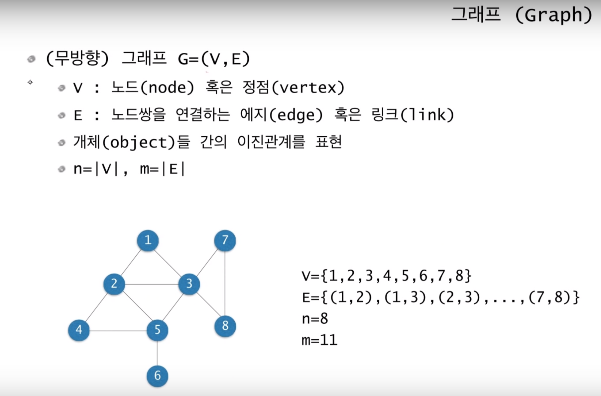
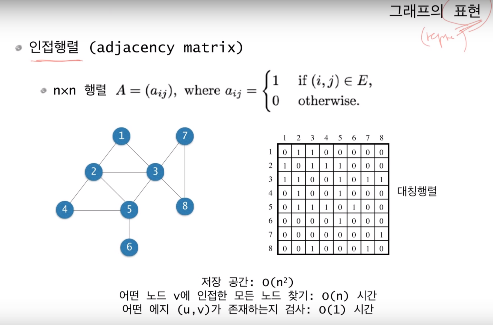
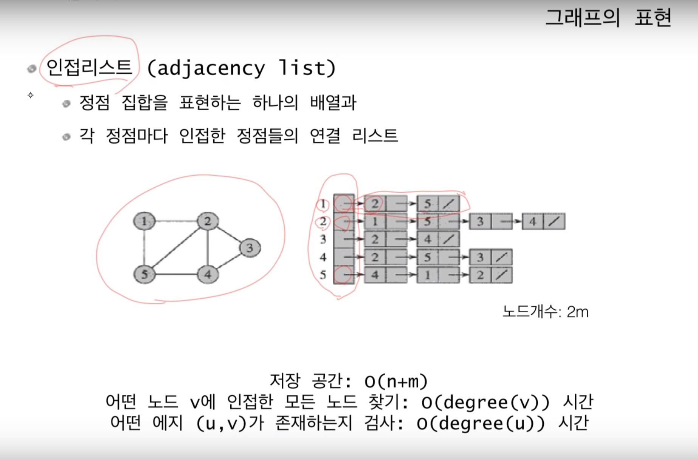
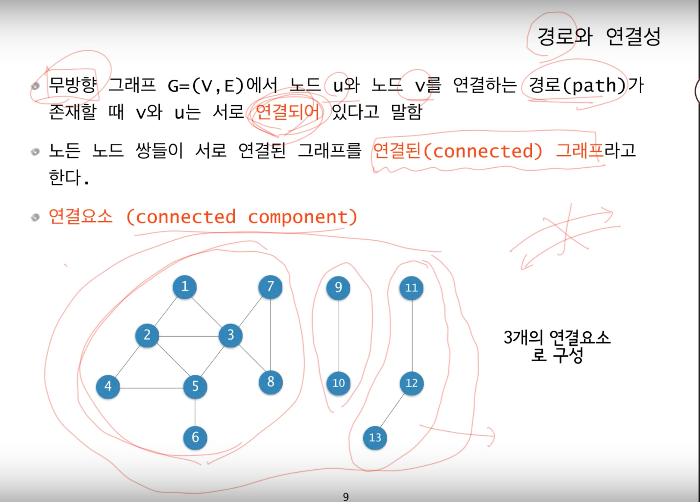
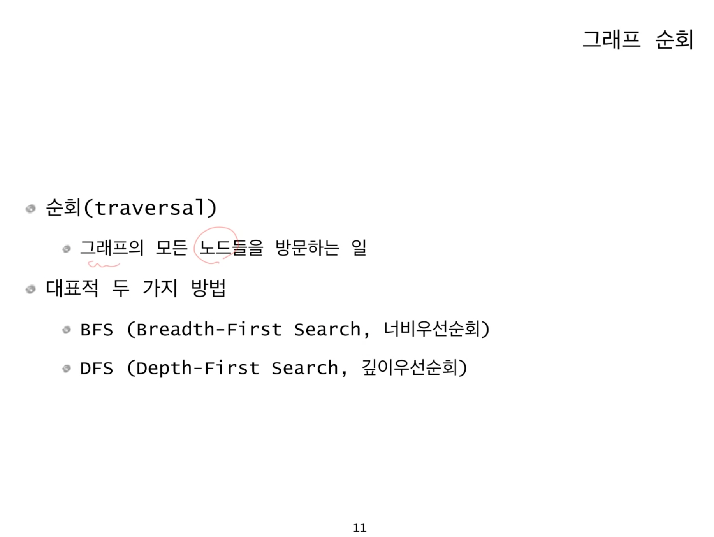

## Graph Algorithm

### Basic concept

그래프는 인접 행렬, 인접 리스트로 나타낼 수 있다.

* 인접 행렬

인접 행렬은 2차원 배열을 이용해 그래프를 표현한다. 배열을 특성상 특정 원소를 찾는 데에 걸리는 시간복잡도는 O(1) 이므로 *어떤 edge 가 존재하는지*     검사를 굉장히 빨리 할 수 있다.

* 인접 리스트 

인접 리스트는 1차원 배열과 링크드 리스트를 사용하여 그래프를 표현한다. 정점 개수를 길이로 하는 1차원 배열에 각 정점에 인접해 있는 정점들을 리스트 형태로 저장한다. 인접리스트를 이용한 그래프 표현의 공간복잡도는 길이 n의 1차원 배열과 리스트에 저장된 총 노드개수가 2m 개 이기 때문에 O(n + 2m) 이지만 상수는 생략되므로 O(n + m) 으로 나타낼 수 있다. 

Java 에서 인접리스트는 2개의 ArrayList을 사용하여 구현한다.

* 인접 행렬과 인접 리스트 비교

어떤 노드 v에 인접한 모든 노드들을 찾을 때는 인접 리스트가 행렬보다 유리하다. 인접 행렬은 한 행의 모든 배열요소들의 값이 1인지 0인지 모두 검사해야 하므로 시간복잡도 O(n) 이 소요되지만, 인접 리스트는 해당 노드의 리스트의 길이만큼만(degree of v) 검사하면 되므로 O(degree(v)) 최악의 경우 O(n-1) 이 될 수도 있으나 그 외의 경우에는 인접 행렬보다 유리하다. 

하지만 정점 u, v를 잇는 edge 가 존재하는지 여부를 검사할때는 인접 행렬은 해당 원소에 바로 접근이 가능해 O(1)이 소요되지만 인접 리스트에서는 역시 해당 리스트의 노드들을 모두 검사해야 하므로 리스트의 길이 (degree of u)만큼의 시간복잡도인 O(degree(u)) 가 소요되므로 이때는 인접 행렬을 사용하는 것이 유리하다. 

* 경로와 연결성

* 그래프의 순회 (traversal)

순회는 그래프의 모든 노드들을 한번씩 방문하는 것을 말한다.

