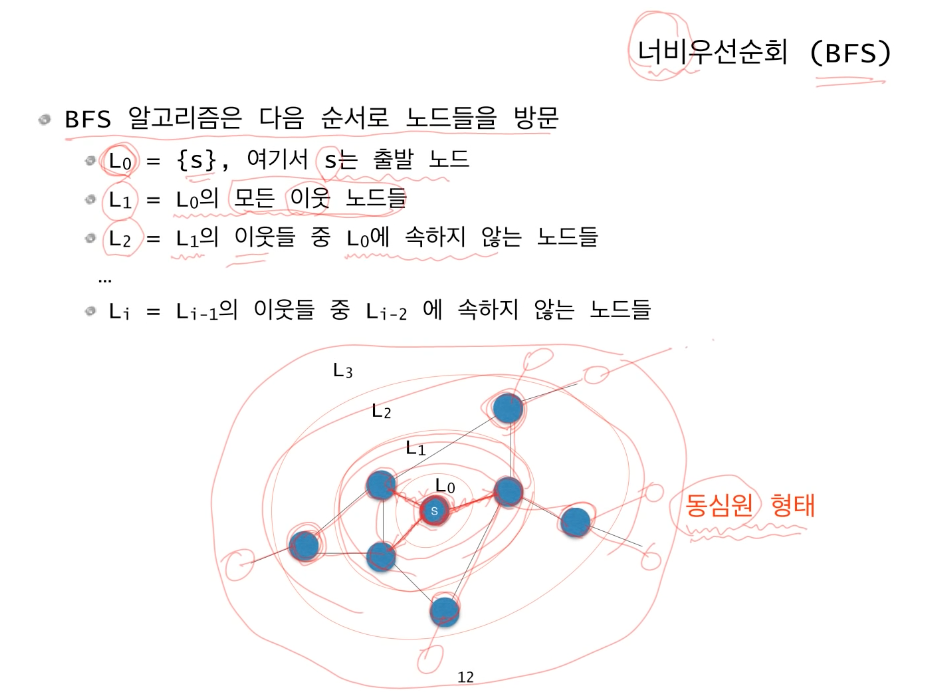
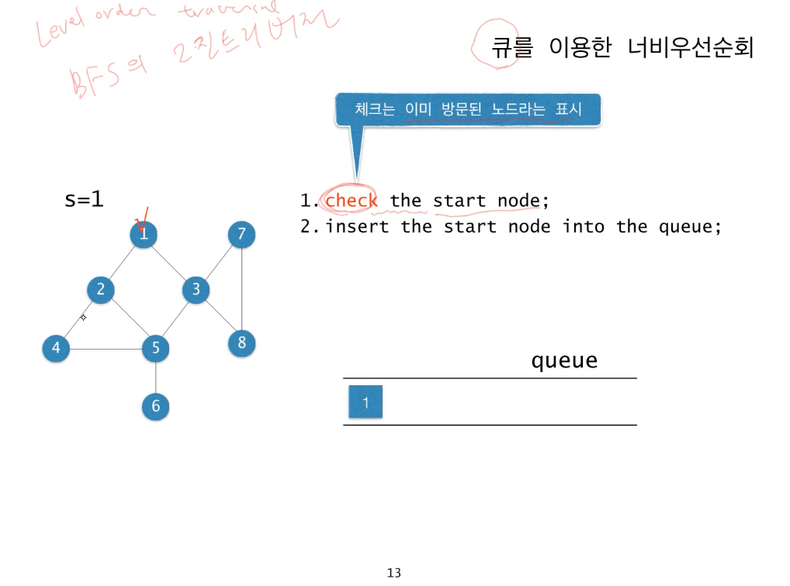
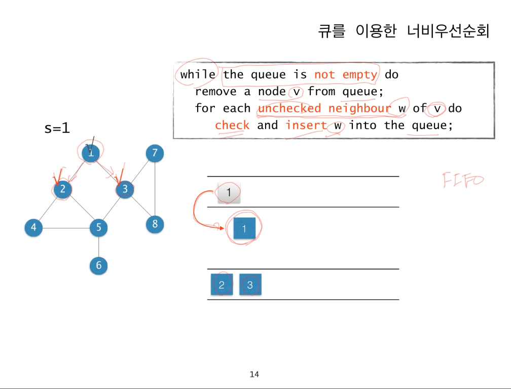
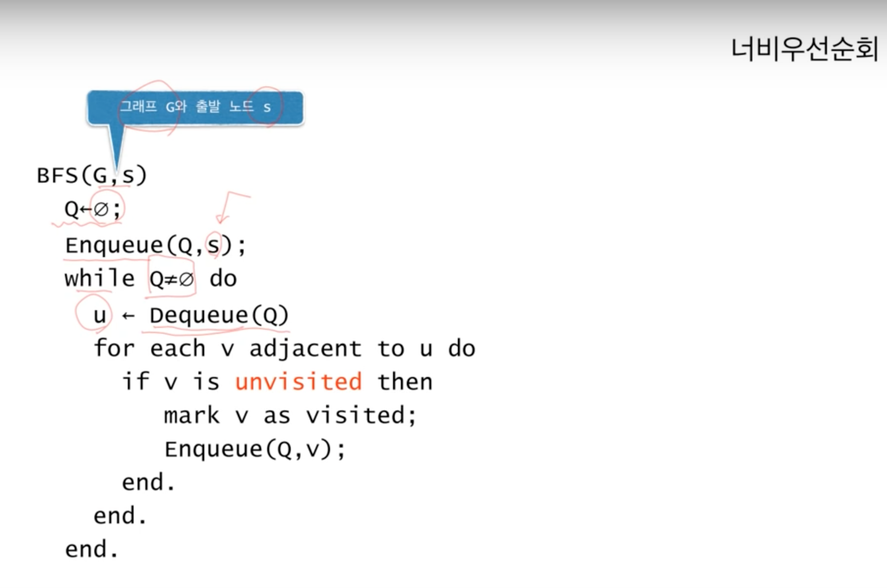

## Graph Algorithm

### DFS (Depth First Search)

DFS 역시 BFS 와 마찬가지로 그래프의 모든 정점을 방문하는 알고리즘이다. Layer 별로 정점을 방문하는 BFS 와는 다르게 DFS 는 현재 정점과 인접한 edge 들을 하나씩 검사하다가, 아직 방문하지 않은 정점으로 향하는 edge 이 있으면 무조건 그 edge 을 따라가는 방법이다. edge 따라가다가 **더 이상 갈곳이 없을 때** 는 바로 전 edge 로 돌아간다. 


바로 위에서 설명했듯이 더 따라갈 edge 가 없는 경우 이전 edge 로 다시 돌아와야하는 특성 때문에 지금까지 지나온 정점들을 저장해야 하는데 **재귀호출** 을 이용하면 이를 쉽게 구현할 수 있다. 재귀호출한 함수가 종료하면 호출한 위치로 다시 돌아오기 때문이다. 

* DFS의 구현 


먼저 DFS을 하기 위해서는 그래프를 표현할 인접 리스트 또는 인접 행렬과 각 정점의 방문여부를 저장하는 배열을 마련해야 한다. 그런 다음 출발 정점부터 시작해서 인접한 정점 중 방문하지 않은 정점이 발견되면 그 정점을 방문하고 또 그 정점에 인접한 정점 중에서 unvisited 인 정점을 방문하는 것을 반복하는 `dfs()` 함수를 구현한다. 이때 그래프가 disconnected, 즉, 그래프의 component 가 2개 이상일 경우 `dfs()` 만 구현해서는 모든 component 를 탐색할 수 없기 때문에 그래프의 모든 정점에 대해서 `dfs()` 를 수행하는 dfsAll() 함수를 따로 구현해 주어야 한다.

```
public class DFSandBFS {
	// 그래프의 인접 리스트 표현
	static List<List<Integer>> adj = new ArrayList<>();
	static boolean[] visited;
	public static void dfs(int here) {
		// 해당 정점을 방문했다고 표시.
		visited[here] = true;
		// 모든 인접정점에 대해
		for(int there : adj.get(here)) {
			// 방문하지 않았으면 dfs 를 수행.
			if(!visited[there]) 
				dfs(there);
		}
		// 더 이상 방문할 정점이 없으므로, 재귀호출을 종료하고 이전 정점으로 돌아간다.	
	}
	
	// 모든 정점을 방문한다.
	public static void dfsAll() {// 그래프의 컴포넌트가 2개 이상일 경우가 있기 때문에 필요.
		// visited 를 모두 false 로 초기화한다.
		visited = new boolean[adj.size()];
		java.util.Arrays.fill(visited, false);
		// 모든 정점을 돌면서
		for(int i=0 ; i < adj.size(); i++) {
			if(!visited[i])
				dfs(i);
		}
	}
}

``` 

* 시간복잡도


인접리스트로 구현한 위 코드의 시간복잡도는 O( | V | + | E | ) 이다. // 왜 그런지는 이해가 안됨.
인접행렬로 구현하게 되면 시간복잡도는 O( | V^(2) | ) 이다.


* DFS의 활용


1. 두 정점이 서로 연결되어 있는가 확인하기
DFS 를 이용하면 **두 정점 사이를 잇는 경로가 있는지** 확인이 가능하다. 가능한 이유는 어떤 정점 u에 대해 dfs(u) 를 수행하면 u에서부터 몇 개의 edge 를 거쳐서라도 도달이 가능한 모든 정점들을 다 방문할 수 있기 때문이다. `visited[]` 의 값을 확인해서 연결여부를 쉽게 알 수 있다.


2. 그래프 component 개수 찾기
아주 간단하게 `dfsAll()` 에서 `dfs()` 가 몇 번 수행되는지를 count 하면 component 가 몇 개인지 알 수 있다.


3. 위상 정렬 (Topological Sort)
위상정렬은 DFS로 풀 수 있는 가장 유명한 문제들 중 하나라고 한다. 위상 정렬은 의존성이 있는 작업들이 주어질 때, 이 작업들을 순서대로 정렬해준다. 이때 '*의존성이 있다*  ' 라고 하는 것은 작업 A, B가 있을때 작업 B를 하기 전에 반드시 작업 A를 해야 한다면 작업 B가 작업 A에 의존한다는 뜻으로 해석하면 된다.


의존성이 있는 작업들을 정점으로 해서 그래프로 나타낸 것을 의존성 그래프 (dependency graph) 라고 하는데, 작업 v가 u에 의존한다면 그래프에는 edge (u, v) 가 존재한다. 


의존성 그래프의 특징은 그래프에 **사이클이 없다**는 점이다. 이와 같이 사이클이 없는 방향 그래프를 DAG(Directed Acyclic Graph) 라고 한다. 이런 DAG을 작업들의 의존성을 다 만족시키면서 정렬하려면 **그래프의 모든 edge가 왼쪽에서 오른쪽** 으로 가야 하는데 이런식으로 정렬하는 것을 위상 정렬이라고 한다.


위상정렬을 구현하는 방법은 여러가지가 있는데 가장 직관적인 방법은 들어오는 간선이 하나도 없는 정점들을 찾아 정렬결과의 가장 뒤에 붙이고 그래프에서 이 정점과 이 정점에서 나가는 edge 를 제거하는 과정을 반복하는 방법이 있다.


그러나 DFS를 이용하면 이를 더 쉽게 구현할 수 있다. DFS 를 이용한 방법은 `dfsAll()` 을 수행하면서 `dfs()` 가 종료할 때마다 현재 정점의 번호를 기록한다. 여기서 `dfs()` 가 처음 종료될 때의 현재 정점은 **그래프에서 가장 depth가 깊은 정점** 인 것을 조금만 생각해보면 알 수 있다. 맨 마지막 `dfs()`가 종료될 때의 현재 정점은 그래프에서 depth가 가장 얕은 정점, 즉, 위상 정렬에서 순서가 제일 먼저인 정점이다. 그러므로, `dfsAll()` 의 수행이 끝난 후에 기록한 정점들의 순서를 reverse 하면 그것이 바로 위상 정렬 결과가 된다. 이 알고리즘의 정당성을 증명하는 것은 귀류법을 이용했는데 지금은 넘어가고 나중에 다시 이해하고 써보도록 하겠다. 


4. 오일러 서킷 
오일러 서킷은 그래프의 모든 edge 를 정확히 한번씩만 지나서 시작점으로 돌아오는 경로를 찾는 문제이다. 이 문제는 해당 문제를 만나게 되면 정리할 예정이다. 


### BFS (Breadth First Search)

* BFS (Breadth First Search)


 
BFS 는 시작점에서 가까운 정점부터 순서대로 방문하는 탐색방법으로 다익스트라 최단거리 알고리즘이나 프림의 최소 스패닝 트리 알고리즘의 기본이 된다. 


BFS를 이용한 그래프의 탐색을 하기 위해서는 그래프를 **출발 노드 s에서부터 최소 몇 개의 edge 를 지나야 도달할 수 있는가** 를 기준으로 그래프의 정점들을 분류 할 수 있다. 간선 i개를 지나야 도착할 수 있는 정점의 집합을 Hi라고 부르기로 하자. BFS는 먼저 H0 에 속한 출발 노드 s를 가장 먼저 방문하고, 그 다음 H1 에 속한 정점들을 차례로 방문하고 그다음은 H2, H3 에 속한 정점을 방문한다. 


* BFS 의 구현

BFS 를 구현하는 가장 간단한 방법은 큐(Queue) 를 이용하는 것이다.
큐는 FIFO(First In First Out) 의 특성을 가지고 있는 자료구조 이므로 BFS 를 구현하는 데에 편리하다.





먼저 출발노드 1을 큐에 넣고, 방문했다는 표시를 한다.
다음 1에 인접해 있는 노드 중 아직 방문하지 않은 노드인 2, 3 을 차례로 큐에 넣는다. 다음은 큐에서 2를 꺼내어 2에 인접한 노드 중 역시 방문한 노드 1을 제외한 아직 방문하지 않은 노드 4, 5를 큐에 넣는다. 똑같은 작업을 큐가 빌 때까지 수행하면, 노드 방문 순서는 1 -> 2 -> 3 -> 4 -> 5 -> 7 -> 8 -> 6 이 된다.


이 과정을 pseudo code 로 나타내면 다음과 같다. 



BFS를 실제 코드로 구현해보자. Java 에서 queue 는 인터페이스로 제공되고 있다. `java.util.Queue` 인터페이스 형태로 존재하는데 인터페이스라 실제 구현체가 필요하다. 이 인터페이스에 대한 구현을 LinkedList 나 Priority Queue 를 이용해서 할 수 있는데 나는 아직 Priority Queue 에 대해서 잘 몰라서 LinkedList를 이용해 구현해보려고 한다. 

```
	static List<List<Integer>> bfsAdj = new ArrayList<>();
	
	// start 에서 시작해 그래프를 너비 우선 탐색하고 각 정점의 방문 순서를 반환한다.
	public static List<Integer> bfs(int start) {
		// 각 정점의 방문여부
		boolean[] discovered = new boolean[bfsAdj.size()];
		java.util.Arrays.fill(discovered, false);
		// 방문할 정점 목록을 유지하는 큐.
		Queue<Integer> q = new LinkedList<>();
		List<Integer> order = new ArrayList<>();
		// 시작정점을 방문하고 큐에 넣는다.
		discovered[start] = true;
		q.add(start);
		while(!q.isEmpty()) {
			// queue 에 첫번째로 들어있는 원소를 꺼낸다.
			int here = q.remove();
			// 큐에서 꺼낸 정점을 방문한다.
			order.add(here);
			// 인접한 정점중 아직 미방문인 정점을 방문하고 큐에 넣는다.
			for(int i=0; i < bfsAdj.get(here).size(); i++) {
				int there = bfsAdj.get(here).get(i);
				if(!discovered[there]) {
					discovered[there] = true;
					q.add(there);
				}
			}
		}
		return order;
	}

```
DFS에서는 방문하지 않은 정점의 발견 (discover) 과 방문 (visit) 이 동시에 이루어지지만, BFS 에서는 그렇지 않다. 위 코드를 짧게 요약하면 먼저 시작노드를 발견(discover) 하고 큐에 넣는다. 그런 다음, 큐에 첫번째 노드를 꺼내어 그 노드를 방문하고 현재 노드에 인접한 아직 방문하지 않은 노드들을 큐에 넣는다. 이 과정을 큐가 빌때까지 수행한다. 따라서 BFS 에서는 모든 정점들이 총 3가지의 상태를 가진다. 


1. 아직 발견되지 않은 상태
2. 발견되어 큐에 들어가 있는 상태
3. 방문된 상태


* BFS 와 최단경로 

DFS는 활용범위가 넓은 반면, BFS 는 대부분 딱 한가지의 용도로 사용된다. 바로 **출발 노드 s 에서부터 다른 노드 v 까지 도달하는 길이가 가장 짧은 경로, *최단경로*** 를 구하는 용도이다. 앞에서 설명했듯이 BFS 의 순회 형태는 동심원이다. L1 에 속한 노드들은 s로부터 최단경로가 1인 노드들이고, L2에 속한 노드들은 최단경로가 2인 노드들, Ln에 속한 노드들은 최단경로가 n인 노드들이다.


BFS 를 이용해 최단거리를 계산하기 위해 시작정점에서부터 모든 정점까지의 최단 거리를 `distance[]` 라고 하자. 


edge (u, v) 를 통해 정점 v를 처음 발견해 큐에 넣었다고 하자. 이때 시작점으로부터 v까지의 최단 거리 `distance[v]` 는 시작점으로부터 u까지의 최단거리 distance[u] 에 1을 더한 것이다. 

```
distance[v] = distance[u] + 1
```
구현 코드는 아래와 같다.

```
// start 에서 시작해 그래프를 너비 우선 탐색하고 시작점부터 각 정점까지의
	// 최단거리와 너비우선탐색 스패닝 트리를 계산한다.
	// distance[i] = start 부터 i까지의 최단거리
	// parent[i] = 너비 우선 탐색 스패닝 트리에서 i의 부모의 번호, 루트인 경우 자신의 번호
	void bfs2(int start, int[] distance, int[] parent) {
		distance = new int[bfsAdj.size()];
		// -1 로 초기화
		java.util.Arrays.fill(distance, -1);
		parent = new int[bfsAdj.size()];
		java.util.Arrays.fill(parent, -1);
		// 방문할 정점 목록을 유지하는 큐
		Queue<Integer> q = new LinkedList<>();
		distance[start] = 0;
		parent[start] = start;
		q.add(start);
		while(!q.isEmpty()) {
			int here = q.remove();
			// here의 모든 인접 정점을 검사한다.
			for(int i=0; i < bfsAdj.get(here).size(); i++) {
				int there = bfsAdj.get(here).get(i);
				// 처음보는 정점이면 큐에 집어넣는다.
				if(distance[there] == -1) {
					q.add(there);
					// 최단거리를 계산.
					distance[there] = distance[here] + 1;
					parent[there] = here;
				}
			}
		}
	}
	// 스패닝 트리를 이용해서 
	// v로부터 시작점까지의 최단 경로를 계산한다.
	List<Integer> shortestPath(int v, int[] parent){
		List<Integer> path = new ArrayList<>();
		// path 에 v를 넣는다.
		path.add(v);
		// 루트 노드에 도달할때까지 수행.
		while(parent[v] != v) {
			v = parent[v];
			path.add(v);
		}
		Collections.reverse(path);
		return path;
	}
```